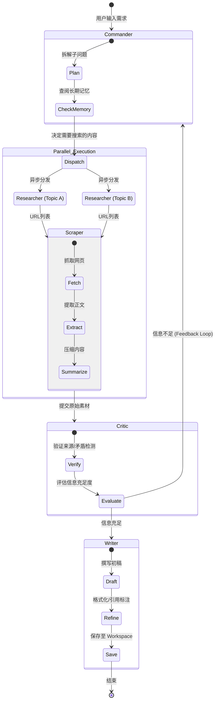

### 一、 总体架构设计

Deep Research 的核心在于“发散（搜索）- 收敛（总结）- 迭代（反馈）”。我们将利用 LangGraph 的图结构来管理这种非线性的流程。

#### 1. 系统架构图 (Mermaid Class Diagram)

这个图展示了系统模块、存储层与 Agent 的关系。

```mermaid
classDiagram
    class User {
        +submit_task()
        +receive_feedback()
    }

    class Orchestrator {
        +GlobalState
        +plan_workflow()
        +dispatch_tasks()
    }

    class FileSystem {
        +Root: /app_data
        +Workspace: /sessions/{session_id}/
        +AgentMemory: /memory/{agent_name}/
    }

    class AgentBase {
        <<Interface>>
        +String role
        +List tools
        +process(State)
        +read_memory()
        +write_memory()
    }

    class ResearcherAgent
    class ScraperAgent
    class CriticAgent
    class WriterAgent

    AgentBase <|-- ResearcherAgent
    AgentBase <|-- ScraperAgent
    AgentBase <|-- CriticAgent
    AgentBase <|-- WriterAgent
    
    Orchestrator --> AgentBase : Manages
    AgentBase --> FileSystem : R/W
    User --> Orchestrator : Interaction
```

#### 2. 业务流程图 (Mermaid State Diagram / LangGraph)

这个图展示了 DeepAgents 内部的状态流转，重点体现了 **并行搜索** 和 **循环反馈**。



---

### 二、 Agent 列表与工具/MCP 规划

为了实现职责边界清晰，我们将每个 Agent 视为一个独立的“节点（Node）”。

#### 1. Commander (指挥官 / 主节点)
*   **职责**：整个系统的调度中心。负责解析用户 Query，拆解为 Sub-queries，控制 LangGraph 的 `State` 流转，决定是继续搜索还是开始写作。
*   **输入**：用户 Query + 全局状态（State）。
*   **输出**：路由指令（Next Node）或最终回复。
*   **特有工具**：
    *   `list_agents`: 查看可用下属。
    *   `read_agent_memory`: 读取特定 Agent 的历史经验（如果需要）。
    *   `create_plan`: 结构化输出规划 JSON。

#### 2. Researcher (搜寻专家)
*   **职责**：负责寻找“在哪里有答案”。它不负责深读，只负责广度搜索和筛选高质量 URL。
*   **输入**：具体的子问题（Sub-query）。
*   **特有工具/MCP**：
    *   `web_search (Tavily/Google)`: 执行搜索，必须支持高级语法（如 `site:`, `-site:`）。
    *   `query_expansion`: 将自然语言转换为多组搜索引擎友好的关键词。
    *   `memory_recall`: **(长期记忆)** 从 `/memory/researcher/` 读取过去的搜索策略或优质源列表（如：“上次在 arxiv 找论文很准，这次优先用 arxiv”）。

#### 3. Scraper (阅览分析师)
*   **职责**：负责“深度阅读”。将 URL 转化为纯文本，并做初步的信息清洗（去除广告、导航）。
*   **输入**：URL 列表。
*   **特有工具/MCP**：
    *   `scrape_web (Firecrawl/Jina Reader)`: 抓取网页并转为 Markdown。
    *   `parse_pdf`: 处理 PDF 链接。
    *   `context_trimmer`: **(关键)** 如果抓取内容超过 100k tokens，使用 Map-Reduce 或滑动窗口进行摘要，避免撑爆 LLM 上下文。

#### 4. Critic (审计/质检员)
*   **职责**：Deep Research 的质量守门人。检查信息是否回答了问题，是否存在幻觉，引用是否真实。
*   **输入**：Scraper 提取的文本片段 + 原始子问题。
*   **特有工具/MCP**：
    *   `verify_citation`: 检查 URL 是否有效。
    *   `log_issue`: **(长期记忆)** 将常见的错误源记录到 `/memory/critic/blacklists.json`。

#### 5. Writer (撰稿人)
*   **职责**：负责最终内容的生成和格式化。
*   **输入**：经过清洗和验证的所有事实片段。
*   **特有工具/MCP**：
    *   `write_file`: 将报告写入 `/workspace/{session_id}/report.md`。
    *   `save_references`: 将引用列表保存为单独的 JSON/BibTeX。

---

### 三、 内存管理与 Workspace 方案 (依托 DeepAgents/LangGraph)

这是根据你要求的文件式存储进行的详细设计。我们将存储分为 **Workspace (短期/任务级)** 和 **Agent Memory (长期/角色级)**。

#### 1. 目录结构设计
建议在项目根目录下建立 `data` 文件夹：

```text
/data
├── /memory                 <-- 长期记忆 (跨任务持久化)
│   ├── /commander
│   │   └── strategy_log.md      # 记录成功的规划模式
│   ├── /researcher
│   │   ├── trusted_sources.json # 记录高信度域名
│   │   └── query_history.log    # 搜索词历史
│   ├── /critic
│   │   └── fallacy_rules.md     # 积累的逻辑谬误规则
│   └── /writer
│       └── style_guide.md       # 用户偏好的写作风格
│
└── /workspace              <-- 任务工作区 (Session 隔离)
    ├── /session_{uuid_1}
    │   ├── raw_downloads/       # 抓取的原始HTML/PDF
    │   ├── artifacts/           # 中间产物 (cleaned_data.json)
    │   ├── final_report.md      # 最终产出
    │   └── run_trace.log        # 运行日志
    └── /session_{uuid_2}
```

#### 2. Workspace 管理 (Short-term / Artifacts)

在 LangGraph 的执行过程中，产生的大量文本不应全部塞入 LLM 的 Context Window。

*   **机制**：使用 **Reference 引用机制**。
    *   Scraper 抓取完网页后，不把全文传给 Commander，而是：
        1.  将全文保存为 `/workspace/{id}/raw_downloads/page_1.md`。
        2.  生成摘要（Summary）。
        3.  更新 LangGraph State：
            ```json
            "documents": [
                {"id": 1, "summary": "...", "file_path": "./workspace/.../page_1.md"}
            ]
            ```
*   **工具实现**：
    你需要开发一套 `FileSystemTools`，挂载到所有 Agent 上，但限制其读写权限（例如 Writer 只能写 artifacts 目录）。

#### 3. Agent 长期记忆管理 (Long-term / File-based)

每个 Agent 初始化时，通过 `SystemPrompt` 加载其专属文件夹下的“核心记忆”。

*   **写入 (Learning)**：
    *   在任务结束时（或者 Critic 发现严重错误时），触发 `update_memory` 工具。
    *   例如，用户反馈报告太啰嗦。Writer Agent 调用 `append_file` 将 "用户偏好简练风格" 写入 `/memory/writer/style_guide.md`。
*   **读取 (Recalling)**：
    *   Agent 启动时，自动读取 `/memory/{role}/*.md` 的内容注入到 System Message 中。
    *   **代码逻辑示例 (伪代码)**：
    ```python
    def get_agent_system_message(role: str):
        base_prompt = PROMPTS[role]
        
        # 加载长期记忆文件
        memory_path = Path(f"./data/memory/{role}")
        memory_content = ""
        for file in memory_path.glob("*.md"):
             memory_content += f"\n=== Memory from {file.name} ===\n{file.read_text()}"
        
        return f"{base_prompt}\n\n[LONG TERM MEMORY]:\n{memory_content}"
    ```

### 四、 开发实施步骤清单

1.  **基础设施层**：
    *   实现 `FileSystemManager` 类：处理目录创建、路径安全检查（防止路径穿越攻击）。
    *   集成 `Tavily` (搜索) 和 `Firecrawl` (抓取) API。

2.  **构建 MCP / Tools**：
    *   `FileWriteTool`: 输入 {content, filename}，写入当前 Workspace。
    *   `FileReadTool`: 读取指定文件。
    *   `WebSearchTool`: 封装搜索 API，返回结构化 JSON。

3.  **定义 Graph State (LangGraph)**：
    ```python
    class AgentState(TypedDict):
        task: str
        sub_questions: List[str]
        gathered_info: List[Dict] # 包含 summary 和 file_path
        feedback: str
        final_report: str
    ```

4.  **开发 Agent 逻辑**：
    *   使用 Prompt Template 区分角色。
    *   为每个 Agent 绑定 `get_agent_system_message` 函数以加载文件记忆。

5.  **编排图逻辑**：
    *   实现 `workflow.add_conditional_edges` 来处理 Critic 的反馈循环。
    *   使用 `Send` API 实现 Researcher -> Scraper 的并行化。